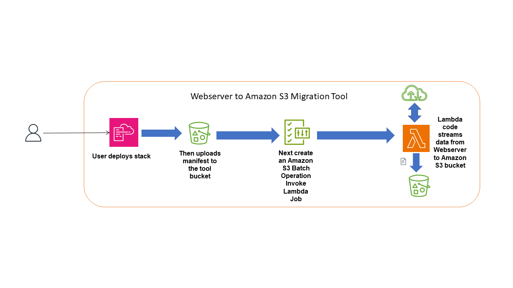
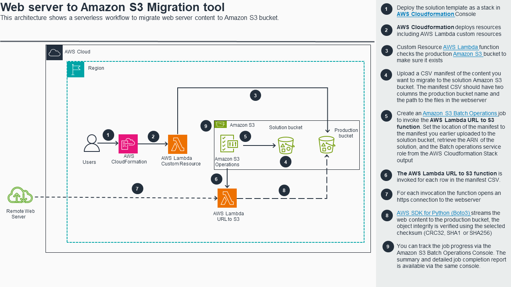
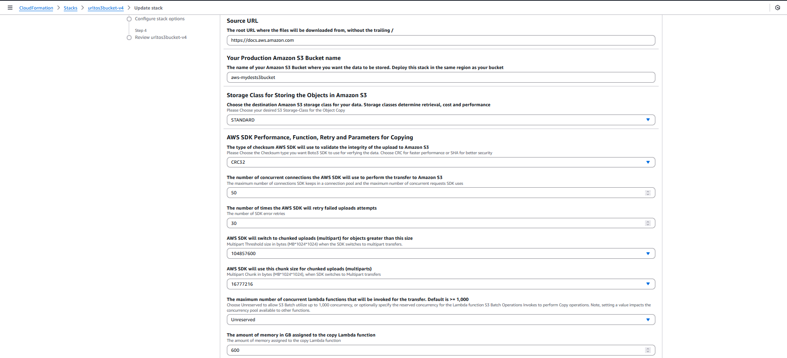
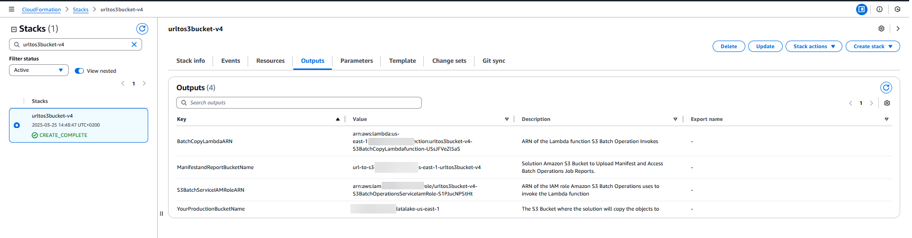
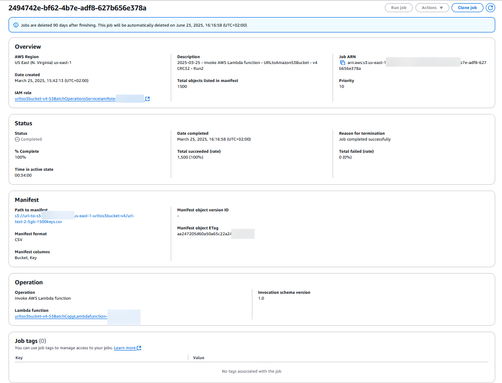
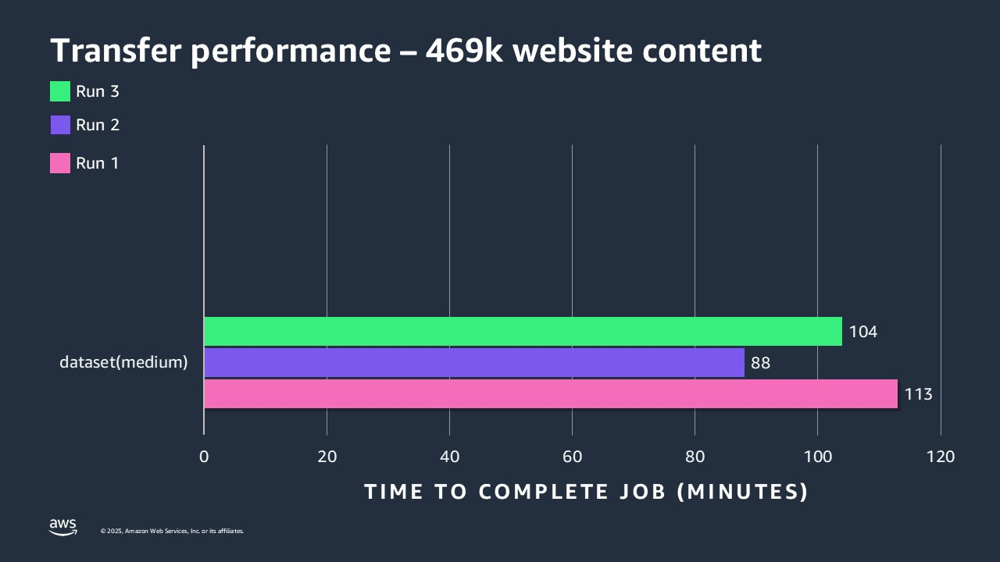

# Webserver to Amazon S3 Migration Tool


## Table of Contents

1. [Overview](#1-overview)
2. [Key Features](#2-key-features)
3. [Cost](#3-cost)
4. [Prerequisites](#4-prerequisites)
5. [Deployment Steps](#5-deployment-steps)
6. [Deployment Validation](#6-deployment-validation)
7. [Starting the Migration](#7-accessing-the-query-results)
8. [Cleanup](#8-cleanup)
9. [Troubleshooting, Guidance, Limitations and Additional Resources](#9-troubleshooting-guidance-limitations-and-additional-resources)
10. [Feedback](#10-feedback)
11. [License](#11-license)
12. [Notices](#12-notices)


<a name="1-overview"></a>
## 1. Overview

The Webserver to Amazon S3 Migration Tool provides an automated serverless workflow to download content from a website URL to an [Amazon S3](https://aws.amazon.com/s3/) bucket. This tool helps customers that do not have backend access (filesystem, SFTP, FTP, S3 API, and Directory listing) to their web content, but wants to migrate their dataset to Amazon S3 bucket.


#### High Level workflow



#### Architecture



<a name="2-key-features"></a>
## 2. Key Features

The tool has the following features

* ****Direct download from a website URL to Amazon S3 bucket****:

This tools provides a mechanism to directly download content from a website URL to an Amazon S3 bucket. 


* ****Object integrity checksum****:

The tool performs an integrity check on each content being uploaded to the S3 bucket using the AWS SDK Boto3. There are three available checksum types CRC-32, SHA-1 and SHA-256


* ****Limit concurrent HTTP Get Requests****:

You can limit the number of concurrent HTTP requests to the source web server by setting a value for the Lambda concurrency via the Stack parameter


<a name="3-cost"></a>
## 3. Cost

There are costs associated with using this migration tool. The tool uses several AWS services, including:

* [Amazon S3](https://aws.amazon.com/s3/)
* [AWS Lambda](https://aws.amazon.com/lambda/)
* [AWS CloudFormation](https://aws.amazon.com/cloudformation/)
* [AWS Identity and Access Management (IAM)](https://aws.amazon.com/iam/)

Please refer to the pricing pages of these services for detailed cost information. The actual cost will depend on various factors including the number of Amazon S3 Batch Operation Jobs, and the number and amount of content transferred.

See below a sample Cost report including free tier for downloading approximately 20,809 objects sizes 22.8MB, 70MB and 5.6GB each, to an Amazon S3 bucket, multiple Batch Operations jobs (25) were run during the testing. This does not include the Amazon S3 API request costs


|Service	|Cost Description	|Usage Quantity	|Amount	|
|---	|---	|---	|---	|
|Amazon S3	|Amazon Simple Storage Service BatchOperations-Jobs	|25 Jobs	|$6.25	|
|Amazon S3	|Amazon Simple Storage Service BatchOperations-Objects	|20,809 objects	|$0.02	|
|AWS Lambda	|AWS Lambda - Total Compute for ARM - US East (Northern Virginia)-Tier-1	|1,593,677.204 Lambda-GB-Second	|$21.25	|


Optimizing Costs:
* If your website content is largely made up of smaller objects sizes, you can consider reducing the predefined Lambda function memory of 648MB to a smaller amount to optimize cost Lambda costs. 
* You can also reduce the number of Amazon S3 Batch Operations jobs by having more rows in each CSV manifest


<a name="4-prerequisites"></a>
## 4. Prerequisites

To use this solution, you need:

* An AWS Account and an IAM role or user with appropriate permissions
* Basic knowledge of AWS CloudFormation
* A source webserver where your website content is stored
* A manifest or inventory of the webserver content. For example if you want to migrate a PDF of the Amazon S3 user guide, with the URL " https://docs.aws.amazon.com/pdfs/AmazonS3/latest/userguide/s3-userguide.pdf" , then "https://docs.aws.amazon.com" will be your root URL and you will add the content path "pdfs/AmazonS3/latest/userguide/s3-userguide.pdf" to the CSV manifest.
* A destination production Amazon S3 bucket where you want to migrate your webserver content to
* You also need to understand and determine the right Amazon S3 storage class that is best fit for your content


<a name="5-deployment-steps"></a>
## 5. Deployment Steps

1. Download the CloudFormation template, for [here](deployment/support-tool-server-access-logs-latest.yaml) 
2. Log in to the AWS Management Console and navigate to the CloudFormation service.
3. Choose "Create stack" and upload the template file.
4. Fill in the stack parameters:

| Name       | Description |
|:--------- |:------------ |
|Stack name	| Any valid alphanumeric characters and hyphen |
|Source URL	| The webserver base URL for example if your content is located in this URL https://docs.aws.amazon.com/pdfs/AmazonS3/latest/userguide/s3-userguide.pdf, the base URL is https://docs.aws.amazon.com	|
|Your Production Amazon S3 Bucket name	| Your production Amazon S3 bucket where the data will be stored 	|
|Storage Class for Storing the Objects in Amazon S3	| Choose the right Amazon S3 Storage class that meets your need. For objects frequently accessed you can leave the default STANDARD. If you want to archive the data, choose GLACIER_IR	|
|The type of checksum AWS SDK will use to validate the integrity of the upload to Amazon S3	| Amazon S3 provides support for various checksums to verify the integrity of the data being transferred before storing it, choose your desired checksum type, for faster performance leave the default CRC32	|
|The number of concurrent connections the AWS SDK will use to perform the transfer to Amazon S3	| This setting determines the maximum number of connection pools and the maximum concurrency the Boto3 SDK uses to perform multipart transfers.  	|
|The number of times the AWS SDK will retry failed uploads attempts	| Sets the maximum number of retries for the Boto3 SDK	|
|AWS SDK will switch to chunked uploads (multipart) for objects greater than this size	| AWS SDKs S3 clients can upload data to Amazon S3 using a single Put or multipart upload (chunked). This value sets the value above which the SDK switches to multipart uploads	|
|AWS SDK will use this chunk size for chunked uploads (multiparts)	|The size of each chunk/parts the SDK uses to upload data to Amazon S3	|
|The maximum number of concurrent lambda functions that will be invoked for the transfer	| Set this value to determine the maximum number of concurrent functions invocations for this function.	|
|The amount of memory in GB assigned to the copy Lambda function	|Choose your desired memory for the Lambda function.	|


* Review and create the stack.

Sample stack deployment screenshot:

 


<a name="6-deployment-validation"></a>
## 6. Deployment Validation

* Wait for the CloudFormation stack to reach the CREATE_COMPLETE status:
* Check your the Stack Output section and copy all the information there, you will need these information for the next tasks




<a name="7-starting-the-migration"></a>
## 7. Starting the Migration

You will need to generate a CSV manifest of the files located on your webserver. Next, upload this manifest to the Amazon S3 bucket and use it for creating the Amazon S3 Batch Operations Job. Here is an example CSV manifest:

```
aws-myproductionbucketname,AmazonS3/latest/userguide/s3-userguide.pdf


```

```
aws-myproductionbucketname,builds/Software%20Setup%206.0.2.exe


```

Note: "aws-myproductionbucketname" is your production Amazon S3 bucket where you want transfer the webserver content to. The content path has to be a valid URL encoded path

Create an Amazon S3 Batch Operations Invoke Lambda Job to start the migration process. Follow these steps to start:

1.	Go to the Amazon S3 console.
2.	From the navigation pane, choose Batch Operations and choose Create job. 
    o	For Manifest format, select CSV and enter the S3 location. Then, choose Next.
    o	For Operation type, select Invoke AWS Lambda function.
    o	For Lambda function, select the Lambda function that has been automatically created, to locate the function, start typing the Stack name, this will filter the displayed function names. The function name will be in the format “StackName-S3BatchCopyLambdafunction-.” For example, if you specified your CloudFormation stack name as “urltos3” then the S3 Batch Lambda function name will be “urltos3-S3BatchCopyLambdafunction-.” For Invocation schema version leave it at the default "Version 1.0, then, choose Next.

3.	For Path to completion report destination, enter the name of the Amazon S3 bucket automatically created by the solution. The name of the bucket is also available in the Stack output section


4.	Amazon S3 Batch Operations requires permissions to be able to run successfully, so we need an IAM role granting it the required permissions:At the Permissions section, use the IAM role that has been automatically created for the S3 Batch Operations service, to locate the IAM role, start typing the Stack name to filter the displayed IAM role names. The role name will be in the format “StackName-S3BatchOperationsService-.” For example, if you specified your CloudFormation stack name as “urltos3” then the S3 Batch Operations service IAM role name will be “urltos3 -S3BatchOperationsService-.” Once you successfully locate the IAM role, please select the role. Then, choose Next.
5.	On the Review page, review the details of the job. Then, choose Create job.
6.	After you create the job, the job’s status changes from New to Preparing. Then, the status changes to Awaiting your confirmation. To run the job, you must choose the Job ID to open the job details and then choose Run job. Next choose Run Job again to start the job.
7.	After the job completes, check the [completion report](https://docs.aws.amazon.com/AmazonS3/latest/userguide/batch-ops-job-status.html) to confirm that all the objects have been successfully migrated. You can also check the destination S3 bucket.




Note:
If the destination Amazon S3 bucket has default encryption with Customer Managed KMS, you will need to grant the solution AWS Lambda Copy function IAM role access to the KMS Key. To locate the solution IAM role, please goto the CloudFormation Stack you just created, choose the Resources section, copy and paste S3BatchCopyLambdaFunctionIamRole into the Search Resources field. Choose the link under the PhysicalID column, this will open a new browser tab with the details of the IAM role.


<a name="8-cleanup"></a>
## 8. Cleanup

To avoid ongoing costs, delete the CloudFormation stack when you're done:

1. Go to the CloudFormation console.
2. Select the stack you created.
3. Choose "Delete" and confirm.

This will remove all resources created by the solution, except the Amazon S3 bucket containing the job completion results. 

A lifecycle expiration rule is automatically applied to the guidance S3 bucket to expire all objects after 90 days of creation. If you want to retain the job results for a longer period, please disable the rule or copy it to a different Amazon S3 bucket.

<a name="9-troubleshooting-guidance-limitations-and-additional-resources"></a>
## 9. Troubleshooting, Guidance, Limitations and Additional Resources

### Performance, Troubleshooting and Guidance

The tool is dependent on the availability and performance of multiple underlying AWS services including S3, Lambda and IAM services and the source Webserver.

If you have a very large number of objects in the manifest, it is recommended to keep each job below 1 billion. 

The solution uses the Amazon S3 Batch Operations Lambda Invoke Job for the migration. Not all objects sizes can be copied
within the current Lambda function 15-minute timeout limit. The solution has been tested successfully, under
ideal conditions, with up to 10.4GB single objects size 

The template contains some predefined values that apply to the Lambda
function and the Boto3 SDK code, mainly: **SDkThroughput**: *1*, **multipart_threshold**: *104857600*, **multipart_chunksize**: *16777216*, **max_retries**: *30*, **LambdaMemory**: *648*, **CopyFunctionReservedConcurrency**: *Unreserved*. You can optionally modify the SDK parameters as required.

Amazon S3 Batch Operations (BOPs) is an at least once execution engine,
which means it performs at least one invocation per key in the provided
manifest. In rare cases, there might be more than one invocation per
key, this might lead to task failures.

As a best practice, we recommend applying a [lifecycle
expiration](https://docs.aws.amazon.com/AmazonS3/latest/userguide/mpu-abort-incomplete-mpu-lifecycle-config.html)
rule to expire incomplete multipart uploads to your production Amazon S3 bucket that might
be caused by failed tasks.

To address performance issues, please refer to [S3 performance
guidelines](https://docs.aws.amazon.com/AmazonS3/latest/userguide/optimizing-performance.html).
I have also provided some quick tips below:

1.  Consider enabling [S3 Request
    metrics](https://docs.aws.amazon.com/AmazonS3/latest/userguide/metrics-configurations.html)
    to track and monitor the request rates and number of 5XX errors on
    your S3
    [bucket](https://docs.aws.amazon.com/AmazonS3/latest/userguide/configure-request-metrics-bucket.html).

2.  Please consider reducing your request rate, by reducing the Lambda reserved concurrency value. S3 Batch Operations will utilize all available Lambda concurrency,
    up to 1,000. If you have a need to reserve some concurrency for
    other Lambda functions, you can optionally reduce the concurrency
    used by a Lambda function by setting the reserved concurrency in the
    **Stack** parameter **"CopyFunctionReservedConcurrency",** and
    specify a desired value less than 1,000. Note, setting a value
    impacts the concurrency pool available to other functions.

3.  If issues with slow performance, excessive throttling, or other
    issues persist, contact AWS Support with the error message and [S3
    RequestID and Extended
    RequestID](https://docs.aws.amazon.com/AmazonS3/latest/userguide/get-request-ids.html)
    in the Amazon S3 Batch Operations failure
    [report](https://docs.aws.amazon.com/AmazonS3/latest/userguide/batch-ops-examples-reports.html)
    or [function CloudWatch
    Logs](https://docs.aws.amazon.com/lambda/latest/dg/python-logging.html),
    for additional support. You can also get S3 requestIDs by querying
    [S3 Access or
    Cloudtrail](https://docs.aws.amazon.com/AmazonS3/latest/userguide/logging-with-S3.html)
    logs if enabled.

For very large workloads; hundreds of millions of objects or Terabytes
of data or critical workloads with tight deadlines, please consider
contacting your AWS Account contact before starting the migration
process.

#### Performance Testing Result

* Dataset (Medium) – Object Count: 469k, Total Object size: 20TB



### Limitations

* The solution is designed uses AWS SDK Boto3 running on a Lambda function, consider that Lambda has a maximum timeout value of 15 mins
* The maximum supported individual objects size that can be transferred is around 10GB

### Additional Resources

* [AWS Lambda Developer Guide](https://docs.aws.amazon.com/lambda/latest/dg/welcome.html)
* [Amazon S3 Batch Operations](https://docs.aws.amazon.com/AmazonS3/latest/userguide/batch-ops.html)
* [Amazon S3 User Guide](https://docs.aws.amazon.com/AmazonS3/latest/userguide/Welcome.html)
* [AWS Identity and Access Management (IAM) User Guide](https://docs.aws.amazon.com/IAM/latest/UserGuide/introduction.html)


<a name="10-feedback"></a>
## 10. Feedback

To submit feature ideas and report bugs, use the [Issues section of the GitHub repository](https://github.com/aws-solutions-library-samples/guidance-for-automating-analysis-of-amazon-s3-logs-on-aws/issues) for this guidance

<a name="11-license"></a>
## 11. License

This solution is licensed under the MIT-0 License. See the [LICENSE](LICENSE) file.


<a name="12-notices"></a>
## 12. Notices

See [CONTRIBUTING](CONTRIBUTING.md#security-issue-notifications) for more information.

This document is provided for informational purposes only. It represents current AWS product offerings and practices as of the date of issue of this document, which are subject to change without notice. Customers are responsible for making their own independent assessment of the information in this document and any use of AWS products or services, each of which is provided "as is" without warranty of any kind, whether expressed or implied. This document does not create any warranties, representations, contractual commitments, conditions, or assurances from AWS, its affiliates, suppliers, or licensors. The responsibilities and liabilities of AWS to its customers are controlled by AWS agreements, and this document is not part of, nor does it modify, any agreement between AWS and its customers.


